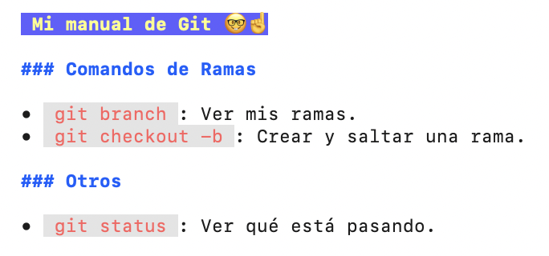

# Mi manual de Git 🤓☝️ 

### Comandos de Ramas
* `git branch`: Ver mis ramas.
* `git checkout -b`: Crear y saltar una rama.

### Otros
* `git status`: Ver qué está pasando.

## Mi terminal con Glow 🧚🏽

